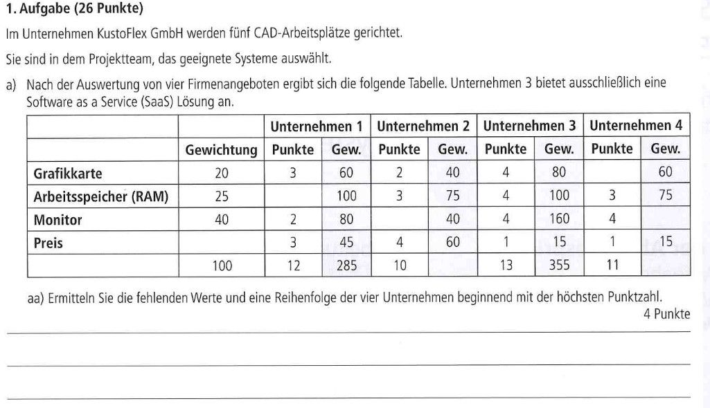

# Inhaltsverzeichnis

1. [[#Support & Serviceanfragen (First-, Second- und Third-Level-Support)]] 
2. [[#Situationsgerechte Kundenkommunikation (z.B. Kundengespräch via Webinar)]] 
3. [[#Kundenbedarf ermitteln und Angebote unterbreiten]] #notready #keinplan
4. [[#Quantitative und qualitative Angebotsbewertung]] #notready 
5. [[#Interpretation englischsprachiger Texte]] #notready 
6. [[#Technische und kaufmännische Texte in deutscher und englischer Sprache]] #notready 
7. [[#Präsentation und Medienkompetenz]] #notready

---

## Support & Serviceanfragen (First-, Second- und Third-Level-Support)

**First-Level-Support:** Hier arbeiten qualifizierte, aber weniger fachkundige Mitarbeiter, die das Problem eventuell bereits lösen können oder es an den Second-Level-Support und letztlich dann an den Third-Level-Support weitergeben.

**Second-Level-Support:** Hier arbeiten spezialisierte Fachleute das Problem, der Mitarbeiter nutzt einen Teil seiner Arbeitszeit zur Weiterbildung. Erarbeitete Lösungen speichert er in einer Wissensdatenbank, um den First-Level-Support zu unterstützen.

**Third-Level-Support:** Hersteller bzw. externe Stellen; Kann auch Fachabteilung oder Programmierer selbst. Er stellt hier die höchste fachliche Ebene des Supports.

außerdem:

- **Dringlichkeit (eng. "Urgency"):** Wie stark wirkt sich die Störung auf das Erreichen des Ziels aus?
- **Auswirkung (eng. "Impact"):** Wie viele Mitarbeiter sind betroffen?

plus:

###### Vorteile:
- Nachvollzierbarkeit aller Anfragen
- Systematische Bearbeitung von Anfragen
- EInhaltung von Service-Level-Agreements
- Automatisierung von Antworten und Statusmeldungen
- Kostenüberwachung für die Bearbeitung von Anfragen

---

## Situationsgerechte Kundenkommunikation (z.B. Kundengespräch via Webinar)

- Anpassung der Sprache an das technische Verständnis des Kunden (Laie vs. IT-Experte)
- Webinare und Remote-Support:
	- Nutzen von Bildschirmfreigabe-Tools (z.B. Teamviewer, AnyDesk, Zoom, Microsoft Teams).
	- Strukturierte Vorgehensweise: Begrüßung -> Problemaufnahme -> Lösungsvorschläge -> Umsetzung
	- Aktives Zuhören und kundenfreundliche Sprache verwenden.
- Dokumentation nach dem Gespräch (Lösungsschritte, nächste Maßnahmen)

Prüfungsrelevante Themen:
- Kundenzufriedenheit durch klare Kommunikation
- Ticketsysteme und deren Bedeutung
- Protokollierung von Gesprächen zur Nachverfolgung

---

## Kundenbedarf ermitteln und Angebote unterbreiten

- **Anamnese:** Klärung der Anforderungen durch gezielte Fragen (z.B. "Wie viele Nutzer haben Sie?"/"Welche Anwendungen sollen laufen?").
- **Angebotsphase:**
	- Auswahl passender Hard-/Softwarelösungen basierend auf den Anforderungen.
	- Preis-Leistungs-Verhältnis beachten
	- ggf. Alternativangebote vorschlagen
- **Präsentation des Angebots:**
	- Klare Darstellung der Vorteile
	- Aufzeigen von Skalierbarkeit und Zukunftssicherheit

###### Prüfungsrelevante Themen:
- **Bedarfanalyse** (Was benötigt der Kunde wirklich?).
- **Wirtschaftlichkeitsbetrachtung** (Kosten/Nutzen).
- **Vergleich von Lösungen** (Cloud vs. On-Premises, Open Source vs. Proprietär).

----

## Quantitative und qualitative Angebotsbewertung

auch als Angebotsvergleich genannt

###### Quantitativ
- Bezugspreis / Preis pro Stück
- Bezugskonten
- Rabatt / Skonto

###### Qualitativ
- Support
- Qualität
- Nachhaltigkeit / Umweltschutz / Regionalität
- Zuverlässigkeit
- Geschäftsbeziehung

###### Folgen, wenn kein Angebotsvergleich durchgeführt wurde
- Mangelnde Qualität: Beschwerden, Reparaturkosten, Imageverlust
- Lieferzeit zu lange: Fehlerverkäufe
- Zahlungsziel zu kurz: Liquiditätsengpässe

###### Bezugskalkulation
$$

\begin{equation}
\begin{matrix}
    Listeneinkaufspreis \\ 
    -Lieferantenrabatt \\ 
    =Zieleinkaufspreis \\
    -Lieferantenskonto \\
    =Bareinkaufspreis \\
    +Bezugskosten \\
    =Bezugspreis
\end{matrix}
\end{equation}

$$
Kurzgesagt:
- Rabatt abziehen
- Skonto abziehen
- Lieferkosten dazurechnen

###### Nutzwertanalyse
- Beurteilungsverfahren von qualitativen und quantitativen Kriterien
- Gewichtung der einzelnen Kriterien
- Alle Gewichtungen zusammengerechnet ergeben immer Eins
- Jede der einzelnen Auswahlmöglichkeiten bekommt eine Punkteanzahl zwischen 1 und 10
- Nutzwert ergibt sich aus der Multiplikation von Gewichtung und Punktzahl

Beispielaufgabe Nutzwertanalyse:

---

## Interpretation englischsprachiger Texte#

- Es gibt so viele Quellen, Fehlermeldungen usw in der IT-Welt, die nur auf englisch verfasst sind.
- Wichtig ist das Versthene von technischen Fachbegriffen (z.B. "Kernel Panic", "Fault Tolerance").
- Nutzung von Übersetzungstools oder Fachwörterbüchern

Beispiele, die schon in der Prüfung vorkommen würde...
- Lesen von Hersteller-FAQs
- Patchnotes oder Release Notes verstehen
- Fehlermeldungen interpretieren und Lösungen finden.

Prüfungsrelevante Themen:
- Fachbegriffe im IT-Englisch
- Übersetzen und Zusammenfassen von technischen Anleitungen
- Fehler

---

## Technische und kaufmännische Texte in deutscher und englischer Sprache

Prüfungsrelevante Themen:
- E-Mail-Formulierungen im IT-Umfeld
- Technische Dokumentation erstellen
- Rechtliche Aspekte bei Lizenzen (EULA, Open-Source-Lizenzen)

Kaufmännisch gemeint:
- Angebote
- Rechnungen
- Bestellungen
- und Lizenzbedingungen verstehen und interpretieren (EULA, Open-Source und co)

Technisch gemeint:
- Handbücher 
- Installationsanleitungen
- Change-Logs
- Wartungsprotokolle oder Fehlertickets schreiben

---

## Präsentation und Medienkompetenz

